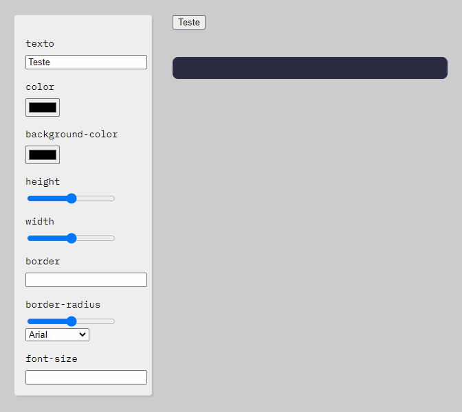

<h1 align="center">
Criador de botões
</h1>

Cria código css para botões. 

  

  

  
   

## Tecnologias usadas

- **HTML**
- **JavaScript** 
- **CSS** 

Feito com ❤️ por Igor Tuag 👋 [Entre em contato!](https://www.linkedin.com/in/igortuag/)
